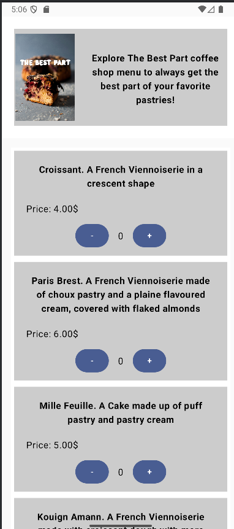

# Mobile-Dev-Assign-1
## Title:
The Best Menu App

## Description/Overview:
This app allows you to navigate our menu and order pastries or coffees. It calculates the total and displays the receipt with a QR code. 

## Example of what the app looks like/Screenshots:

## Setup Instructions:
Open the project on Android Studio and run the MainActivity.kt 
or open the app on an android device!

## Bugs:
Once the place order button has been pressed the qr code is always there and it gets dynamically changed everytime the quantity 
of the food items are changed. I don't think that it's necessarily a bad thing since the client always has access to their receipt, but
it is important to address.

## Sources
Open source picture: 
https://www.pexels.com/photo/cooked-food-2451673/
(The text was added by me on Canvas)
Code for qr code:
 https://gitlab.com/crdavis/texttoqrcode/-/blob/master/app/src/main/java/com/example/texttoqrcode/MainActivity.kt?ref_type=heads
LazyColumn:
https://developer.android.com/develop/ui/compose/lists

